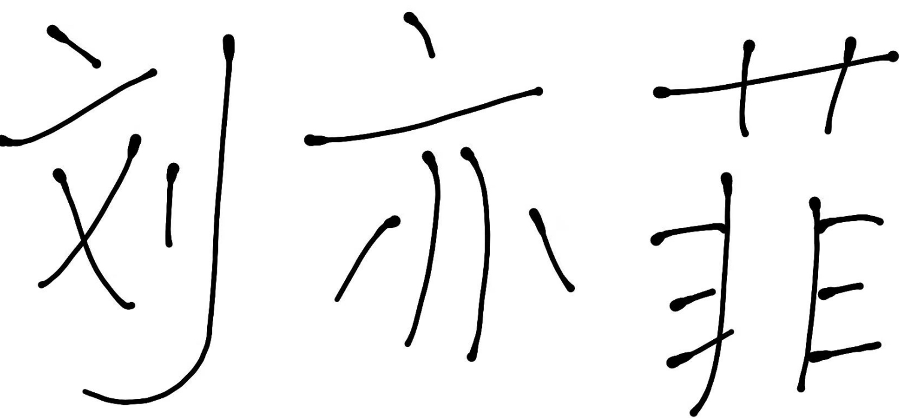

# OFA-OCR-ONNX

基于 **OFA (One For All)** 模型的强大光学字符识别（OCR）系统，使用 ONNX Runtime 优化实现高效推理。本项目提供高性能的文本识别能力，支持中文和英文文本。

## 🌟 功能特性

- **顶尖OCR技术**: 基于OFA统一多模态模型构建，在文本识别任务上达到卓越的准确率
- **ONNX优化**: 利用ONNX Runtime实现快速、跨平台的CPU推理
- **中英双语支持**: 原生支持中文和英文文本识别
- **Beam Search解码**: 实现高效的束搜索算法，生成最优序列
- **轻量便携**: 无需重型框架依赖，易于部署
- **预训练模型**: 包含预量化的ONNX模型，开箱即用

## 🚀 快速开始

### 环境要求

```bash
pip install numpy onnxruntime opencv-python
```

### 安装步骤

```bash
git clone https://github.com/your-repo/OFA-OCR-ONNX.git
cd OFA-OCR-ONNX
```

### 下载模型文件

从 Google Drive 下载 ONNX 模型文件，并将其放置在 `onxw/` 目录中：

[模型文件下载](https://drive.google.com/drive/folders/1SM4d0P_M5Km3UEca61pBWGOIvNKFw5jH)

### 使用方法

```python
from oxn_infer import OfaTasks

# 初始化OCR引擎
ocr = OfaTasks()

# 对图像执行OCR识别
result = ocr("path/to/your/image.png")
print("识别结果:", result)
```

### 命令行运行

```bash
python oxn_infer.py
```

## 📁 项目结构

```
OFA-OCR-ONNX/
├── onxw/                    # ONNX模型文件
│   ├── encoder.onnx         # 全精度编码器
│   ├── encoder_qu.onnx      # 量化编码器（推荐使用）
│   ├── decoder.onnx         # 全精度解码器
│   ├── decoder_qu.onnx      # 量化解码器（推荐使用）
│   └── vocab.txt            # 词汇表文件
├── utils/                   # 工具模块
│   ├── preprocess.py        # 图像预处理管道
│   ├── tokenization.py      # 中文文本分词器
│   └── 优化模型文件.py       # 模型优化工具
├── te/                      # 测试图像目录
│   ├── ff.png
│   └── yk.png
├── oxn_infer.py             # 主推理脚本（FP32）
├── oxn_infer_f16.py         # 推理脚本（FP16）
├── LICENSE                  # 许可证文件
└── README.md                # 英文说明文档
```

## 🧠 模型架构

### 编码器
- **输入**: 480x480的RGB图像
- **输出**: 隐藏状态、注意力掩码和位置嵌入
- **层数**: 12层Transformer编码器
- **隐藏层维度**: 768

### 解码器
- **输入**: 编码器输出 + token序列
- **输出**: token预测的logits
- **层数**: 12层Transformer解码器
- **束宽**: 5（可配置）

### 预处理流程
1. **缩放**: 保持宽高比，填充至480x480
2. **归一化**: 缩放至[-1, 1]，均值为[0.5, 0.5, 0.5]
3. **格式转换**: 转换为CHW格式供模型输入

## ⚡ 性能指标

| 指标 | 数值 |
|--------|-------|
| 编码器耗时 | ~200ms (CPU) |
| 解码器耗时 | ~300ms (CPU) |
| 总推理时间 | ~500ms/图像 |
| 支持语言 | 中文、英文 |
| 最大文本长度 | 17个token |

## 📊 示例结果

### 输入图像



### 输出
```
结果: ["你好世界"]
```

## 🔧 配置说明

您可以在 `oxn_infer.py` 中自定义以下参数：

- **束宽**: 调整 `active_hypos` 以平衡速度和准确率
- **最大长度**: 修改 `range(17)` 支持更长的文本序列
- **量化模式**: 在量化模型(`_qu.onnx`)和全精度模型之间切换
- **执行提供器**: 修改 `providers` 使用GPU (`["CUDAExecutionProvider"]`)

## 🛠️ 开发指南

### 添加新语言

1. 将词汇添加到 `onxw/vocab.txt`
2. 更新 `utils/tokenization.py` 支持新的token类型
3. 使用新语言数据微调或转换模型

### 模型优化

运行优化脚本来量化您自己的模型：

```bash
python utils/优化模型文件.py
```

## 📝 许可证

本项目采用 MIT 许可证 - 详见 [LICENSE](LICENSE) 文件。

## 🙏 致谢

- [OFA: Unifying Architectures, Tasks, and Modalities Through a Simple Sequence-to-Sequence Learning Framework](https://arxiv.org/abs/2202.03052)
- [ONNX Runtime](https://onnxruntime.ai/) 提供高性能推理
- [OpenCV](https://opencv.org/) 提供图像处理能力

## 📬 联系方式

如有问题、建议或贡献，请在仓库中提交Issue。

---

*❤️ 为OCR社区打造*